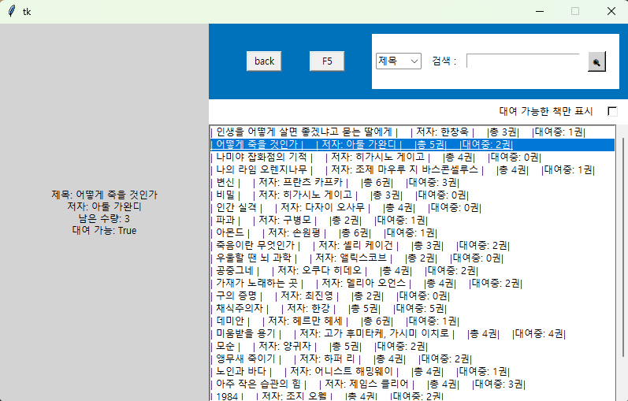

# book manager sort (Tkinter)

도서 검색/대여 가능 여부 확인 프로그램  
제목/저자 기준으로 Naive String Matching 알고리즘을 사용한 문자열 탐색 기능 구현  
검색 시 소요된 시간 측정 및 팝업 출력  
도서 데이터는 books.txt 파일에서 로드  

## 실행 화면




---

## 주요 기능
- books.txt 파일에서 도서 목록 로드
- 제목 / 저자 기준 문자열 검색
- Naive String Matching 알고리즘 직접 구현 및 적용
- 검색 수행 시간 측정 및 출력
- 도서 정보 확인 가능
  - 제목
  - 저자
  - 전체 권수
  - 대여중 권수
  - 대여 가능 여부
- Tkinter 기반 GUI 인터페이스

---

## 사용 기술

- Python
- Tkinter (GUI)
- File I/O
- Naive String Matching Algorithm


---

## 실행 방법

manager.py 와 books.txt 를 같은 폴더에 위치 후 실행

```
python manager.py
```


---


## 파일 구성

```
manager.py
    프로그램 실행 파일 (GUI, 검색 기능, 알고리즘 구현)

books.txt
    도서 데이터 저장 파일
```

---

## 구현 목적

- 문자열 탐색 알고리즘 동작 방식 이해
- Naive String Matching 알고리즘 직접 구현 경험
- GUI 프로그램 구조 및 이벤트 처리 이해
- 파일 기반 데이터 로드 및 처리 구현


---

## 특징

자료구조 수업에서 학습한 문자열 탐색 알고리즘을 실제 프로그램 형태로 구현

알고리즘을 단순 이론이 아닌 GUI 프로그램에 적용하여 동작 과정과 실행 시간 확인 가능
